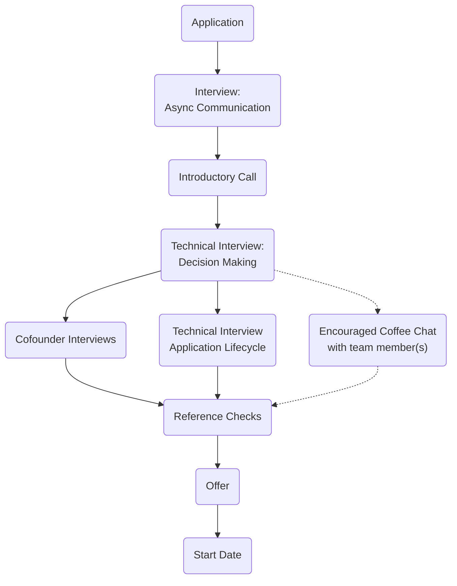
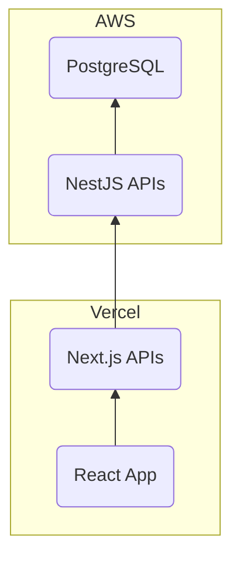

Hi friends!

I'm James A Rosen ([GitHub](https://github.com/jamesarosen), [LinkedIn](https://www.linkedin.com/in/jamesrosen)). Welcome to Clarasight's Engineering Interview Packet for our [Senior Software Engineer](https://grnh.se/e59eba155us) opening. I am excited to provide you as much up front information as I can. At Clarasight, we're big on living our values and within Engineering we're no different. This interview packet is a manifestation of us valuing intentional experimentation to learn and will transparently evolve as we learn more over time. It is also a representation of us "just trying" a [two-way-door decision](https://www.inc.com/jeff-haden/amazon-founder-jeff-bezos-this-is-how-successful-people-make-such-smart-decisions.html). We welcome corrections and suggestions.

I strongly believe that by striving towards a ["Perfect Information Game"](https://en.wikipedia.org/wiki/Perfect_information), we'll collectively make the best and most efficient decisions. Let's get to it!

# The Opportunity

## The Team

### Engineers

We are an experienced team of three that strongly embody [Clarasight's value](https://www.clarasight.com/company) "Make Stone Soup" (based on the [parable](https://en.wikipedia.org/wiki/Stone_Soup)).
- (circa 2022-09) Santiago Parra, Senior Software Engineer
- (circa 2023-08) James Rosen ([GitHub](https://github.com/jamesarosen), [LinkedIn](https://www.linkedin.com/in/jamesrosen/)), Staff Software Engineer
- (circa 2023-11) Valentina Oppen ([GitHub](https://github.com/valentinaOppen), [LinkedIn](https://www.linkedin.com/in/valentina-oppen-75a1856b/)), Senior Software Engineer

### Team Values

We are and will continue to galvanize and evolve. We have not truly operationalized our values, but are making bets that directionally these are the Engineering values at Clarasight.

1. We value thoughtful, transparent, and intentional action.
2. Most decisions we face are "two-way door" decisions. We value making informed decisions efficiently.
3. We're a small, talented team with big ambitions. We value pragmatism and index towards "Right Tool" over "Popular Tool". 
4. We value tension and failure as tools for improvement. 
5. We value first-principled thinking and strive to [stand on the shoulders of giants](https://en.wikipedia.org/wiki/Standing_on_the_shoulders_of_giants).
6. We value communication and believe feedback is a gift. We solicit feedback intentionally and ["to the left"](https://glossary.cncf.io/shift-left/).

### Our Collaborators

All the engineers work throughout the stack. We work closely with our Product Manager and Product Designer. Depending on the project, we may also work closely with folks in Customer Success, Business Operations, or Marketing.

### Methodology

We do our best to follow Agile, but we're not strictly a Scrum or Kanban team. We have a weekly cadence and do frequent demos. We prefer to track customer- and engineer satisfaction over velocity.

## What we do
Clarasight is reinventing how enterprises close the gap between climate-related intent and action, and provides leaders across all levels of the organization a real-time Carbon Planning & Analysis (CP&A) platform to manage emissions with the same rigor as they manage their financials. Some of the most recognizable companies in the world rely on Clarasight’s software to reduce emissions, save costs, and protect revenues in alignment with emissions targets and business objectives.

Clarasight's clients are some of the largest and most complex organizations in the world. Providing them with the product that enables them to manage emissions with the same rigor as they manage their financials requires a high degree of sophistication. Additionally projecting the complex, evolving, and interdependent view of carbon emissions adds an unsolved degree of complexity. CP&A occurs in a matrix (across purpose; down functional expertise) across the organization, and providing consistent and contextually relevant information, tools, and actions to each part of the business is critical. Our product delivers a multi-modal, multi-user cohesive experience, and it requires an incredible platform to power it.

If these people, product, and platform challenges sound overwhelming and doing it in a team of three (or better yet four 🙂) sounds wild yet thrilling, let's keep on going. Here's what I believe we need to supplement the team with and what you could bring to the campfire.

## What we're looking for
**You** - I hire people not skillsets.
I want to enable you to drive an outsized impact on the world, the company, our team, and yourself. 

First and foremost, [Clarasight's mission](https://www.clarasight.com/company) to close the gap between climate-related intent and action must deeply resonate. 

Bring your unique experiences, skills, and perspectives to the company and team.

**Early Stage Experience** - 0-to-1 experience in building software products. 
I'm no early stage veteran. This is my second rodeo. I have observed that this datapoint is high signal for success at this stage, particularly in engineering. Not a requirement, but a very nice to have. Work-life balance concept is understood not defined.

**Critical Systems** - Experience designing and building mission critical systems. 
No system truly starts off as mission critical, however almost all are planned to be. These systems, almost by design, have higher degrees of rigor placed upon their operation and design. Two things are particularly relevant:
1. Effective sequencing of decisions that enable the company to scale. It's one step beyond knowing when to slow down to speed up or to take a short cut. It's optimizing across multiple, sequential tradeoff decisions.
2. The surface area of considerations these systems go through. A traditional web application stack typically focuses on optimizing process performance (e.g. request latency) and trace observability. 

**Communication** - Complex problems and solutions require clear communication
The problems we're focused on are hard. The details of the solutions are often quite complex. We must be able to communicate to our audiences, and simplifying will be required.

Software development at Clarasight is an asynchronous process. Clear communication in code reviews, documentation, tickets, etc is a big lever of positive or negative efficiency.

**Systems Thinker** - Ah, something familiar.
We aim to power the most complex organizations in the world in an uncharted space with many degrees of freedom on top of our closest parallel, FP&A. Our platform will be responsible for powering our multi-modal, multi-user, cohesive experience.

**Some Finer Details** - The nice-to-haves
We advocate for intentional first principled thinking, but strongly [stand on the shoulder of giants](https://en.wikipedia.org/wiki/Standing_on_the_shoulders_of_giants). These _nice-to-haves_ reflect this.
- Academic knowledge of a few fields of math such as [Discrete Math](https://en.wikipedia.org/wiki/Discrete_mathematics) , [Graph Theory](https://en.wikipedia.org/wiki/Graph_theory), [Probability](https://en.wikipedia.org/wiki/Probability), [Statistics](https://en.wikipedia.org/wiki/Statistics), [Formal Languages](https://en.wikipedia.org/wiki/Formal_language)
- Academic knowledge of a few fields of computer science such as [Distributed Systems (algo)](https://en.wikipedia.org/wiki/Distributed_algorithm), general data structures, [algorithm analysis](https://en.wikipedia.org/wiki/Big_O_notation). 
- Asynchronous, event-driven architectures
- Data pipeline design, development, and management
- Intersystem schema management
- Accessibility
- Security and privacy: [GDPR](https://gdpr-info.eu/), [ISO 27001](https://www.iso.org/standard/27001), SOC 2, the [OWASP Top 10](https://owasp.org/www-project-top-ten/)

# The Interview Process
Our goal is to find an aligned, mission driven individual that will
- drive an outsized impact on the world, the company, our team, and themselves.
- bring their unique experiences, skills, and perspectives to the company and team.
- grow alongside the company on this journey.

We strive to accomplish this by walking the walk and live our values with a thoughtful, transparent, and intentional process.

## Overview
1. Application
2. Interview: Asynchronous Communication
3. Introductory call
4. Technical Interview: Decision Making
5. Technical Interview: Application Lifecycle
6. Encouraged "coffee chat" with a team member
7. Interview: Co-founders
8. Reference Checks
9. Offer

## Application
If you haven't done so, apply directly on the [job posting](https://grnh.se/e59eba155us) with your resumé or CV.

## Interview: Async Communication
Clarasight is a remote-first company that has employees across timezones from GMT (UTC+0) to PST (UTC-8 during daylight saving time). Efficient and effective communication is critical to the success of the company. We will ask you to respond to one of several prompts using the asynchronous medium of your choice.

## Introductory Call
I strongly believe that the best use of our first synchronous conversation is to obtain mutual alignment and interest, and providing you the opportunity to ask questions gets us there the fastest.

**Recommended candidate preparation**: Prepare 1 to 3 questions that, depending on the answer, would either really excite you or self-select out of the process.

## Technical Interview: Decision Making
The purpose of this interview is two-fold: to better understand your technical depth and breadth, and the decision making frameworks you use. We will start the conversation at the user, often a web technology, and span through the stack. 

## Technical Interview: Application Lifecycle
The purpose of this interview is to "see you in action". We read much more code than we write. We're being intentional with how we gain confidence in your ability to learn and reason about (new) code, empathize with users, and pragmatically see around corners.

We send you a sample application that uses core technologies and frameworks from our tech stack. 

I **strongly acknowledge** that "live coding" is not representative of actual work (outside of brain/hand or driver/passenger pairing). So we offer two different experiences. One where we send the sample application days before, and another where we send it minutes before. Both paths will converge quickly, but how we gain confidence in some of the above items will differ.

- You will onboard yourself to the codebase (by design it does not run). Walk and talk us through your observations about it, how it works, what users experience. 
- We will ask you what you would advocate to improve in your first two weeks.
- We will prompt you with various scenarios that may require system changes.

## Co-founder Interviews
The purpose of these interviews are to give you the opportunity to meet Clarasight's co-founders, [Adam Braun](https://www.linkedin.com/in/arbraun/) and [Phil Charm](https://www.linkedin.com/in/philip-charm-81037a3/) and both ask and answer questions.

## Reference Checks
We'll ask that you provide us one reference that is/was a teammate and one that is/was a supervisor. 

## Offer
We aim to be efficient, and will present three offers, lower cash / higher equity, balanced, higher cash / lower equity. We do not desire to engage in an extended negotiation.

# The Tech Stack
## Infrastructure
[AWS](https://aws.amazon.com/) is our cloud infrastructure provider.
[Vercel](https://vercel.com/) manages our [Next.js](https://nextjs.org/) infrastructure.

We manage and maintain two environments, staging and production. Our Infrastructure as Code (IaC) uses [AWS's CDK](https://aws.amazon.com/cdk/) and has room for improvement.

## Platform and Application
We use [Next.js](https://nextjs.org/) framework for our React application and the associated Backends for Frontend APIs.

We use the opinionated [NestJS](https://nestjs.com/) framework for our [Node.js](https://nodejs.org/) API, which is deployed to [AWS Fargate](https://aws.amazon.com/fargate/) .

We use [PostgreSQL](https://www.postgresql.org/) for our Online Transaction Processing (OLTP) database, which is deployed to [AWS's RDS](https://aws.amazon.com/rds/). 

We use [TypeScript](https://www.typescriptlang.org/) to write all of our JavaScript code.

## Delivery
All of our code is [git](https://git-scm.com/) version controlled on [GitHub](https://github.com/). We use a modified / less mature version of [Trunk Based Development](https://trunkbaseddevelopment.com/) that leverages feature branches, release branches, and feature flags (currently [Split.io](https://www.split.io/)). We run our CI and CD via [GitHub Actions](https://docs.github.com/actions). Both the Next.js and NestJS applications have continuous integration and deployment to our staging environment. Production deploys require a few clicks and we tend to do them a few times per week.
